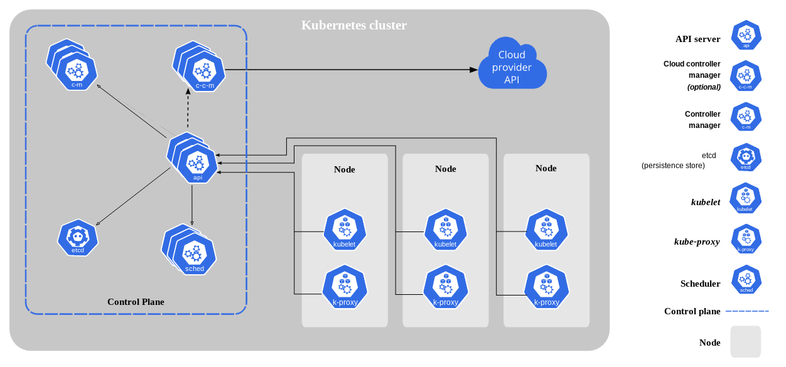

# Kubernetes Troubleshooting

## Inroduction

Kubernetes troubleshooting is the process of identifying, diagnosing, and resolving issues in kubernetes cluster, nodes, pods, or containers.

## Kubernetes Cluster Architecture
  

Each Kubernetes cluster is composed of:

1. **Nodes**
    
    Represent a physical or virtual machine with the container runtime to support one or more containers. Nodes in an operating cluster can be categorized into:
    * **Master node**

      Hosts the cluster’s control plane and is responsible for scheduling workloads, scaling, and managing the cluster state. Each cluster must have at least one master node; however, a typical choice is to provision two or more master nodes for redundancy.
          
    * **Worker node**
    
      Hosts workloads in containers and performs the duties assigned to it by the master node.‍

2. **Control plane**

    Composed of a number of cluster components, it’s responsible for controlling the cluster to achieve a desired state.‍

3. **Kube-API server**

    The front-end server that manages all external communication with the cluster.‍

4. **Etcd**

    The key value database that stores cluster state and data.‍

5. **Kube-scheduler**

    Uses etcd event data to schedule workloads on worker nodes.‍

6. **Kube-controller manager**

    Runs a set of controllers that govern the state of the cluster‍

7. **Kubelet** 

    An agent that runs on each worker node to communicate with the API server, it’s responsible for the deployment of containerized workloads in pods.‍

8. **Kube-proxy**

    Maintains network rules that allow communication between pods and services, both internal and external to the cluster.

## Get Started

## Install ```Kind```

  ```
  curl -Lo ./kind https://kind.sigs.k8s.io/dl/v0.11.1/kind-linux-amd64
  chmod +x ./kind
  mv ./kind /usr/local/bin
  which kind
  kind version
  ```


## Install ``kubectl``
 
```
 curl -LO "https://dl.k8s.io/release/$(curl -L -s https://dl.k8s.io/release/stable.txt)/bin/linux/amd64/kubectl
 chmod +x kubectl
 mv ./kubectl /usr/local/bin/kubectl
 kubectl version --client
```
## Create ```Kind Cluster```
 ```
 kind create cluster
 ```
 
## Install Metrics Server (``kubectl top``)
Issue #1 :: Kubernetes metrics-server Error – Readiness probe failed: HTTP probe failed with statuscode

Solution:
 
- Download https://github.com/kubernetes-sigs/metrics-server/releases/latest/download/components.yaml
- Modify and add "- --kubelet-insecure-tls" in deployment.spec.template.spec.containers.args
- kubectl apply -f components.yaml
- kubectl top nodes
- kubectl top  pod kube-proxy-5p7gr -n=kube-system


### Create Deployment Manifest

```
apiVersion: apps/v1
kind: Deployment
metadata:
  labels:
    app: nginx-test
  name: nginx-test
spec:
  replicas: 1
  selector:
    matchLabels:
      app: nginx-test
  template:
    metadata:
      labels:
        app: nginx-test
    spec:
      containers:
      - image: nginx
        name: nginx-test
        ports:
          - containerPort: 80
            name: http
            protocol: TCP
```

### Create Service Manifest


```
apiVersion: v1
kind: Service
metadata:
  name: nginx-test
spec:
  ports:
  - port: 80
  selector:
    app: nginx-test
```


### Install MetalLB
kubectl apply -f https://raw.githubusercontent.com/metallb/metallb/v0.13.5/config/manifests/metallb-native.yaml
 
### View subnet-mask
```docker inspect <container_name>```

### Create MeatlLB manifest
```
---

apiVersion: metallb.io/v1beta1
kind: L2Advertisement
metadata:
  name: empty
  namespace: metallb-system
---
apiVersion: metallb.io/v1beta1
kind: IPAddressPool
metadata:
  name: example
  namespace: metallb-system
spec:
  addresses:
  - 172.19.254.200-172.19.254.250  #chage first 2 numbers as per subnet mask.
```

## Install Nginx-controller
  kubectl apply -f https://raw.githubusercontent.com/kubernetes/ingress-nginx/controller-v1.3.1/deploy/static/provider/cloud/deploy.yaml

### To add hosts on etc/hosts
```sudo nano /etc/hosts```

### Create Ingress Manifest
```
apiVersion: networking.k8s.io/v1
kind: Ingress
metadata:
  annotations:
    kubernetes.io/ingress.class: nginx
  name: myhost
spec:
  rules:
  - host: myhost.example.com
    http:
      paths:
      - backend:
          service:
            name: nginx-test  # change as per service name
            port:
              number: 80 # change as per service port
        path: /
        pathType: ImplementationSpecific
```